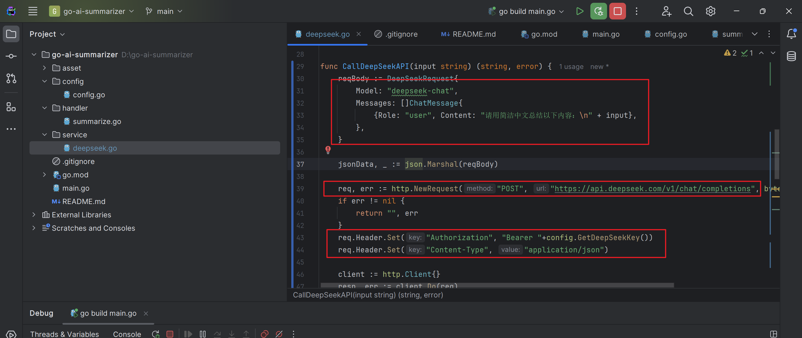

# go-ai-summarizer

🧠 一个使用 Go + DeepSeek 模拟 AI 摘要生成服务的后端项目。

## 功能

- POST /summarize 接口
- 模拟调用大模型（或切换到 DeepSeek/OpenRouter）
- 支持系统环境变量管理 API Key

## 快速启动

```bash
go run main.go
```


## 项目演示截图


### 🔧 模拟接口调用（Mock 模式）


### 📄 Mock 接口响应结果


### 🚀 实际接入模型（文本摘要API 接口示例）



### 🚀 实际接入模型（网页摘要API 接口示例）


### 🔐 环境变量配置（系统变量）
推荐将deepseek API KEY 配置到系统变量中，防止使用.env文件管理泄露

